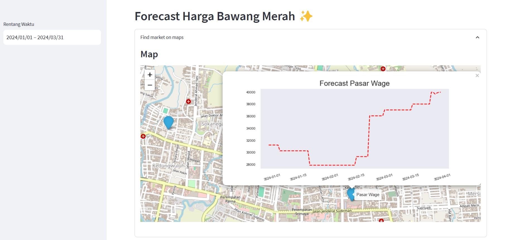

# Forecast Harga Bawang Merah



## Description
Repositori ini berisi implementasi model peramalan harga bawang merah untuk pasar manis dan pasar wage yang terletak di Purwokerto menggunakan Long Sort Term Memory. Model ini menggunakan data harga bawang merah dari tanggal 1 Mei 2017 hingga 31 Desember 2023 untuk meramalkan harga di masa depan.

## Data
Data yang digunakan untuk pelatihan dan pengujian model bersumber dari [Pusat Informasi Harga Pangan Nasional berdasarkan data harga harian](https://www.bi.go.id/hargapangan/TabelHarga/PasarTradisionalKomoditas). Silakan merujuk ke sumber data untuk informasi lebih rinci.

## Project installation to personal virtual environment
Langkah-langkah untuk membuat virtual environment dari proyek ini adalah sebagai berikut:

1. Clone this repository
   ```
   git clone https://github.com/fjrUdn/Forecast-LSTM.git
   ```

2. Move to directory Forecast-LSTM
   ```
   cd Forecast-LSTM
   ```

3. Move to directory Dashboard
   ```
   cd dashboard
   ```

4. Create python virtual environment
   ```
   python -m venv forecast_lstm_venv
   ```

5. Active environment
   ```
   forecast_lstm_venv\Scripts\activate
   ```

6. Install all the requirements inside "requirements.txt"
   ```
   pip install -r dashboard\requirements.txt
   ```

7. Install virtual environment
   ```
   python -m ipykernel install --name=forecast_lstm_venv
   ```

8. Deactive Environment
   ```
   forecast_lstm_venv\Scripts\deactivate
   ```

9. Run streamlit app
   ```
   streamlit run dashboard\dashboard.py
   ```

10. Stop the application program by `ctrl + c`.


© 2024 [Fajar Kamaludin Akhmad](https://www.linkedin.com/in/fajarkamaludinakhmad/)
